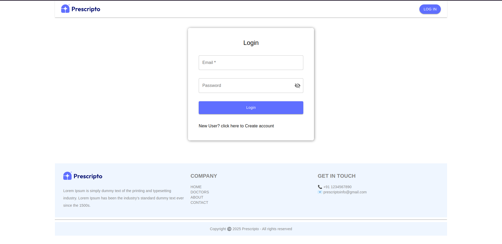
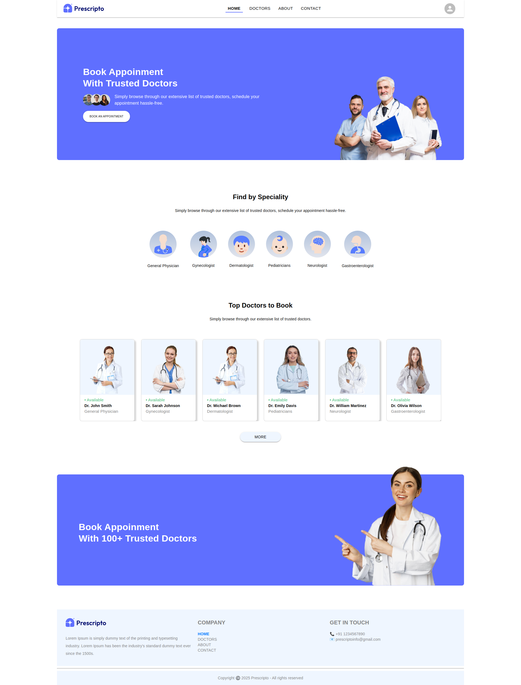
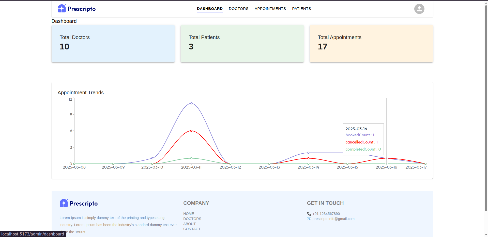

# Doctor Appointment Booking System(Prescripto)

## Introduction
The **Doctor Appointment Booking System** is a MERN stack web application that allows patients to book appointments, doctors to view and update their appointments, and administrators to oversee the platform. Used cloudinary for uploadding the image. It features three different login roles:
- **Patient**: Can book, cancel, and view appointments.
- **Doctor**: Can manage their appointments .
- **Admin**: Can manage users, doctors.

## Features
### 1. Patient
- Register and login.
- Book an appointment with a doctor.
- View upcoming and past appointments.
- Cancel an appointment if necessary.

### 2. Doctor
- Doctor can create by admin only.
- View and update appointment status (completed, canceled).
- Edit profile information.

### 3. Admin
- Manage users.
- View all appointments.

## Tech Stack
- **Frontend**: React, Material-UI (MUI)
- **Backend**: Node.js, Express.js
- **Database**: MongoDB
- **Authentication**: JWT-based authentication with role-based access control

## Installation and Setup
### Prerequisites
Ensure you have the following installed:
- Node.js (LTS version recommended)
- MongoDB (local or cloud-based)
- Git

### Backend Setup
1. Clone the backend repository:
   ```sh
   git clone https://github.com/kumaranhk/doctorAppointmentBooking.git
   cd server
   ```
2. Install dependencies:
   ```sh
   npm install
   ```
3. Create a `.env` file and configure the environment variables:
   ```env
   PORT=4000
   MONGO_URI=your_mongodb_connection_string
   JWT_SECRET=your_jwt_secret
   CLOUDINARY_NAME=your_cludinary_name
   CLOUDINARY_API_KEY=your_cloudinary_api_key
   CLOUDINARY_SECRET=your_cloudinary_secret
   ```
4. Start the backend server:
   ```sh
   npm start
   ```

### Frontend Setup
1. Clone the frontend repository:
   ```sh
   cd client
   ```
2. Install dependencies:
   ```sh
   npm install
   ```
3. Create a `.env` file in the frontend directory:
   ```env
   VITE_BACKEND_URL=http://localhost:4000
   ```
4. Start the frontend application:
   ```sh
   npm run dev
   ```

## Sample Logins
### Admin Login
```sh
Email: admin@gmail.com
Password: admin123
```

### Doctor Login
```sh
Email: olivia.wilson@example.com
Password: admin123
```

### Patient Login
```sh
Email: patient@gmail.com
Password: 1111
```

## Screenshots
### 1. Login Page


### 2. Patient Dashboard


### 3. Admin Panel

